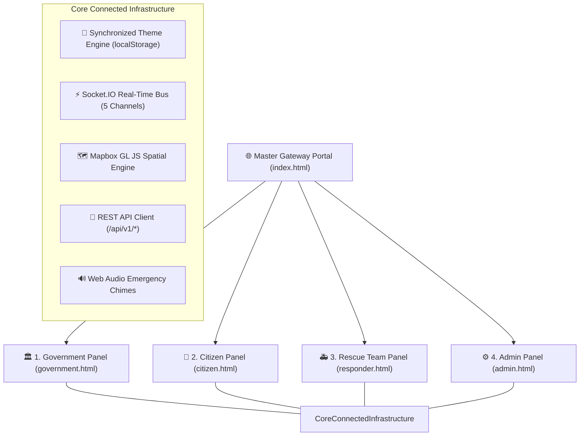

# 🛡️ RakshaSetu — Disaster Preparedness & Emergency Response Platform
### Consolidated Software Requirements Specification (SRS v2.0) Frontend Ecosystem

[-blue.svg)](#)
[](#)
[](#)
[](#)

**RakshaSetu** is an enterprise-grade disaster preparedness and emergency response ecosystem engineered for real-time situational awareness, rapid multi-agency mobilization, and citizen protection during critical incidents (such as major flood inundations across the Brahmaputra Basin).

This repository contains the complete frontend implementation with **4 specialized standalone panels** and a **Master Gateway Portal**, sharing a connected, classy, clean, and creative design system.

---

## 🏛️ Ecosystem Overview & Panel Mapping



---

## 📁 Panel Breakdown

| Panel | Standalone File | Role & Purpose | Key Endpoints (SRS §6) | Color Theme |
|---|---|---|---|---|
| **Universal Hub** | [`index.html`](file:///C:/Users/HP/.gemini/antigravity/scratch/disaster-preparedness-ui/index.html) | **Master Gateway & Live Interactive Previewer**<br>Interactive role switching, desktop/mobile preview drawer. | N/A | Multi-Role Slate |
| **1. Government** | [`government.html`](file:///C:/Users/HP/.gemini/antigravity/scratch/disaster-preparedness-ui/government.html) | **Command & Control Dashboard**<br>Macro GIS spatial maps, AI risk models, and multi-agency coordination. | `GET /api/v1/gov/dashboard/summary`<br>`GET /api/v1/gov/map/live`<br>`POST /api/v1/gov/alerts` | Deep Sapphire & Obsidian (`#1e40af` / `#0f172a`) |
| **2. Citizen** | [`citizen.html`](file:///C:/Users/HP/.gemini/antigravity/scratch/disaster-preparedness-ui/citizen.html) | **Stay Informed, Stay Safe (Citizen Safety App)**<br>One-tap 112 SOS (&lt;3s latency), shelter routing, and AI safety assistant. | `POST /api/v1/citizen/sos`<br>`POST /api/v1/citizen/reports`<br>`GET /api/v1/citizen/map/safety` | Jade Emerald & Pure White (`#16a34a` / `#ffffff`) |
| **3. Rescue Team** | [`responder.html`](file:///C:/Users/HP/.gemini/antigravity/scratch/disaster-preparedness-ui/responder.html) | **Respond & Save Lives (Field Operations HUD)**<br>Priority queue mission scoring, safe navigable channels, and VHF radio. | `GET /api/v1/field/missions`<br>`PUT /api/v1/field/team/status`<br>`POST /api/v1/field/comms` | Solar Amber & Tactical Slate (`#ea580c` / `#120904`) |
| **4. Admin** | [`admin.html`](file:///C:/Users/HP/.gemini/antigravity/scratch/disaster-preparedness-ui/admin.html) | **Manage & Optimize System (Platform Management)**<br>Keycloak RBAC directory, Kafka audit trail, and cloud backup. | `GET /api/v1/admin/dashboard/status`<br>`GET /api/v1/admin/audit-logs`<br>`POST /api/v1/admin/backup/run` | Royal Amethyst & Deep Violet (`#9333ea` / `#0d0714`) |

---

## 🎨 Connected Design System & Aesthetics

### 1. Unified Theme Synchronizer
All pages share a unified theme engine stored under `localStorage.getItem('rakshasetu_theme')`. Toggling between **Dark Mode** and **Light Mode** on any panel or the hub instantly updates all opened tabs upon reload or navigation.

### 2. High-Grade Typography
- **Primary Body & Display**: **`Plus Jakarta Sans`** — A contemporary, geometric sans-serif engineered for digital interfaces and executive dashboards.
- **Telemetry & Technical Codes**: **`JetBrains Mono`** — Monospace font for exact GPS coordinates, latencies, timestamps, and incident tags (`#M-2025-045`, `INC-2025-0012`).

### 3. Frosted Glassmorphism & Ambient Glows
- Translucent backdrop blur (`backdrop-blur-md bg-white/94` and `bg-slate-900/85`).
- Crisp micro-borders (`border-slate-200/80` and `border-slate-800/80`).
- Role-based ambient glow shadows on hover (`shadow-blue-500/20`, `shadow-emerald-500/20`, `shadow-orange-500/20`, `shadow-purple-500/20`).

---

## 🔍 Complete SEO & Semantic Web Architecture

Every page includes comprehensive meta tags and Schema.org structured data (`application/ld+json`) for search engine optimization and automated crawling:

- **OpenGraph Tags**: `og:title`, `og:description`, `og:image`, `og:type`, `og:site_name`, `og:url`.
- **Twitter Summary Cards**: `twitter:card="summary_large_image"`, `twitter:title`, `twitter:description`, `twitter:image`.
- **Schema.org JSON-LD Types**:
  - `government.html`: `GovernmentService` and `GovernmentOrganization`.
  - `citizen.html`: `EmergencyService` with telephone `112`.
  - `responder.html`: `EmergencyService` tactical search-and-rescue operations.
  - `admin.html`: `WebApplication` central management console.
  - `index.html`: `GovernmentOrganization` national directory.

---

## ⚡ Real-Time WebSocket & API Layer (SRS §7.1 & §6)

### WebSocket Event Channels (Socket.IO)
| Channel Name | Direction | Payload Description |
|---|---|---|
| `map.incidents` | Server → Client | Real-time incident geolocations, hazard levels, and verification status. |
| `team.tracking` | Bidirectional | Sub-meter GPS telemetry of deployed rescue squads and craft. |
| `mission.status` | Bidirectional | Mission lifecycle progression (`Assigned`, `In Progress`, `Completed`). |
| `sos.alert` | Client → Server | **P1 Critical** emergency distress beacon with user GPS coordinates. |
| `alerts.broadcast` | Server → Client | Public emergency alert bulletins broadcast to targeted geographic sectors. |

---

## 🧠 AI / ML Mathematical Formulations (SRS §8)

### 1. Z-Score Anomaly Detection (§8.1)
Used by the Government and Admin panels to detect unusual hydrological surges or sudden reporting spikes:
$$z = \frac{x - \mu}{\sigma}$$
- $z < 2$: Normal baseline activity.
- $2 \le z \le 3$: Advisory warning threshold.
- $z > 3$: Critical anomaly — triggers automated alert broadcast.

### 2. Priority Queue Scoring (§8.2)
Used by the Rescue Team HUD to dynamically rank mission triage orders:
$$\text{Priority Score} = \text{Severity} + \text{People Affected} + \text{Distance} + \text{Time Sensitivity} + \text{Available Resources}$$

### 3. Sensing Model Trust Fusion (§8.4)
Fuses disparate data streams into a single trusted zone state:
$$\text{fused\_value} = \frac{\sum_{i=1}^n (w_i \cdot x_i)}{\sum_{i=1}^n w_i}$$
*Trust Weights:* Field Responder ($0.45$) > IoT Water Gauge ($0.30$) > Verified Citizen ($0.20$) > Unverified Citizen ($0.05$).

---

## 💡 Creative Interactive Features

1. **Native Web Audio Emergency Chimes**:
   Built with the browser's native Web Audio API (`AudioContext`). Generates alert chimes and radio telemetry beeps on demand with zero external `.mp3` dependencies.
2. **Live Radar Scanner GIS Overlay**:
   Rotating radar sweep beam rendered directly over the Mapbox GL JS spatial map, simulating continuous sensor scans.
3. **Interactive Inline Preview Drawer (`index.html`)**:
   Allows instant previews of any panel directly on the home gateway with desktop and mobile viewport toggles.
4. **Tactile SOS Ripple Feedback**:
   High-visibility ripple wave animation on the 112 SOS button for rapid recognition in emergency conditions.

---

## 🚀 Getting Started & Execution

### Prerequisites
All panels are completely self-contained with no build steps or heavy node server required to run. All CDNs (Tailwind CSS, Mapbox GL JS, Leaflet, Socket.IO, Lucide Icons, Chart.js, Google Fonts) load automatically in any modern web browser.

### Running the Ecosystem
```powershell
# Navigate to the workspace directory
cd C:\Users\HP\.gemini\antigravity\scratch\disaster-preparedness-ui

# 1. Launch the Unified Role Gateway Portal:
start index.html

# 2. Or launch any specific standalone panel:
start government.html   # Government Command & Control
start citizen.html      # Citizen Safety & SOS App
start responder.html    # Rescue Team Tactical HUD
start admin.html        # Platform Admin & Audit Console
```
